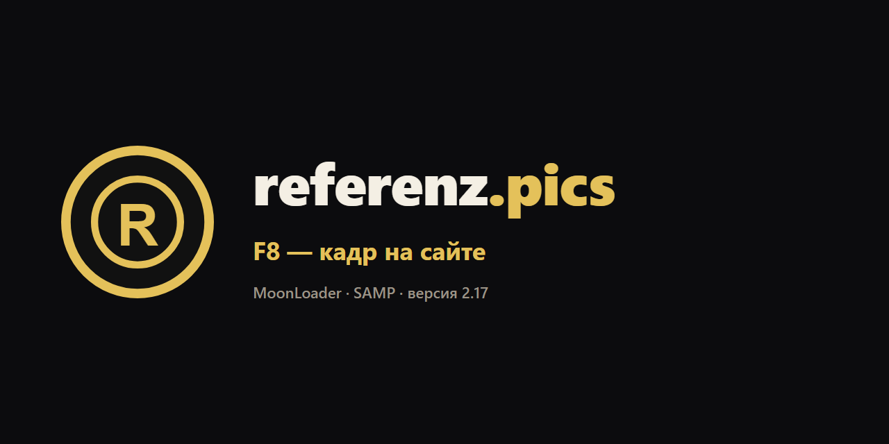
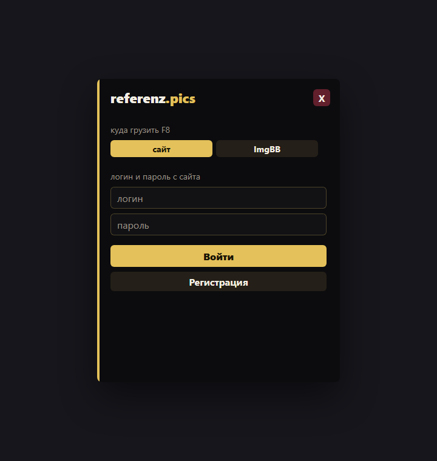
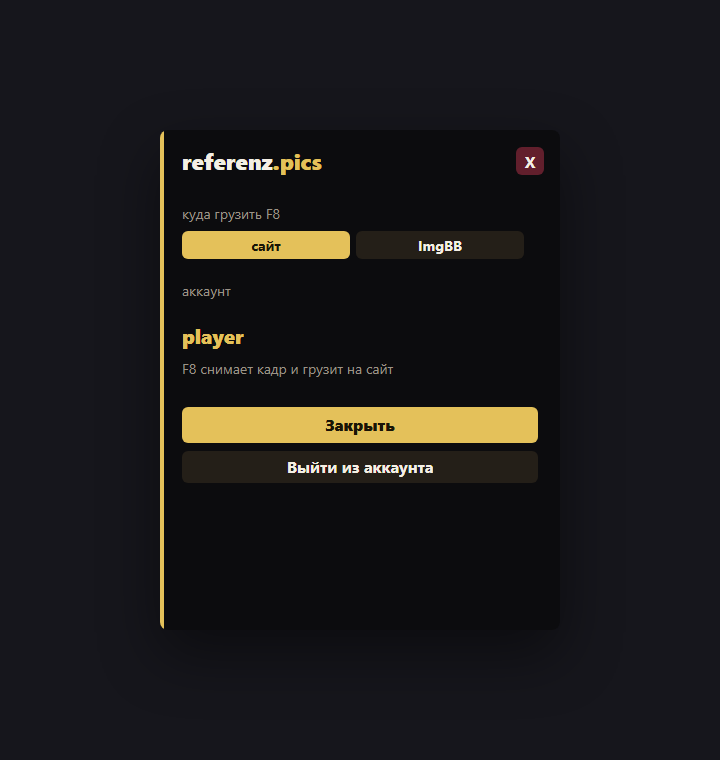

# referenz.pics

F8 в игре — кадр уже на сайте.

Скрипт для MoonLoader. Версия **2.17**. Нужны SAMP и [MoonLoader](https://www.blast.hk/threads/33418/).

Сайт: [referenz.pics](https://referenz.pics)  
Тема на BlastHack: [инструкция и обсуждение](https://www.blast.hk/threads/257840/#post-1696751)

## Установка

1. Скачайте [referenz.pics.lua](referenz.pics.lua) из этого репозитория.
2. Положите файл в папку `moonloader`, рядом с другими скриптами. Итог: `moonloader/referenz.pics.lua`.
3. В игре нажмите **Ctrl+R** или перезайдите.
4. В чат: `/referenz`.

Желательно иметь библиотеку **mimgui**. Без неё скрипт откроет обычные диалоги SAMP: сначала логин, потом пароль.

## Вход

В окне нужны **логин и пароль с сайта**. Кнопка «Регистрация» в том же окне создаёт аккаунт.

Вход через Яндекс на сайте скрипт не принимает: у такого аккаунта нет пароля, а `/referenz` спрашивает логин и пароль.

Логин и пароль запоминаются. После перезахода скрипт входит сам.

## F8

Окно входа закройте. Нажмите **F8**.

Скрипт снимает кадр игры и отправляет его на [referenz.pics](https://referenz.pics). В чат придёт «Скрин во входящих». Кадр лежит в профиле, в разделе «Снимки». Кто его видит, выбирается уже на сайте: только вы, по ссылке или в ленте.

Если F8 нажали, пока окно ещё открыто, в чат придёт «Закройте окно и нажмите F8 ещё раз».

## Куда грузить

В окне два варианта.

| Кнопка | Куда попадает кадр |
| --- | --- |
| сайт | Во входящие на referenz.pics. В чате: «Скрин во входящих». |
| ImgBB | Прямая ссылка на картинку. Ссылка пишется в чат и копируется. Нужен API-ключ с [api.imgbb.com](https://api.imgbb.com/). Видео ImgBB не принимает, F8 и так шлёт картинку. |

Выбор сохраняется. На сайте в настройках можно сменить то же самое, после `/referenz` скрипт подтянет вариант.

## Команды

| Команда | Что делает |
| --- | --- |
| `/referenz` | Открыть окно |
| `/pics` | То же самое |
| `/referenz logout` | Выйти из аккаунта и открыть окно входа |

## Если что-то не так

- **Окно не появилось.** Проверьте, что файл лежит именно в `moonloader`, и нажмите Ctrl+R. В чате должна быть команда `/referenz`.
- **«Нет связи с сайтом».** Игра не достучалась до referenz.pics. Повторите F8 чуть позже.
- **«Не удалось снять кадр».** Окно игры должно быть на экране. Закройте окно скрипта и нажмите F8 ещё раз.
- **«Укажите ключ ImgBB».** Выбран ImgBB, а ключ пустой. Впишите его в окне `/referenz` или вернитесь на кнопку «сайт».
- **После Яндекса скрипт не входит.** Так и задумано. Для игры нужен аккаунт с логином и паролем.

## Обновление

Скачайте новый `referenz.pics.lua`, замените старый в `moonloader` и нажмите Ctrl+R. Логин в `moonloader/config/referenz.ini` при этом не стирается.
